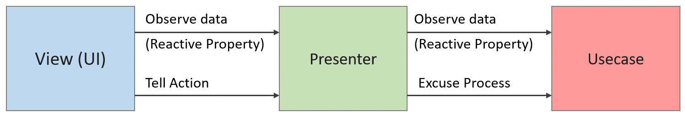

# Simple Clean Architecture Example for .NET Blazor Web Assembly

This is an example project of .NET Blazor Web Assembly to explain the concept of "Simple Clean Architecture".  

## Simple Clean Architecture?
Simple Clean Architecture (SCA) is a software architecture based on the concept of [Clean Architecture](https://blog.cleancoder.com/uncle-bob/2012/08/13/the-clean-architecture.html).
Clean Architecture provides great concept to keep our software clean and less coupled. However, if you make software by the strict guideline of Clean Architecture, your software project structure may be a bit redundant. (e.g., using Repository, Use input port, Data Access, ... to access data)  
SCA is simplified and ready-to-implement design pattern of Clean Architecture. You can see the similarity with MVP, MVVM design patterns. In SCA, we have 5 components (Entity, Gateway, Usecase, Presenter, View) defined in Clean Architecture. Each component should be less coupled and managed by Dependency Injection(DI). We also use Reactive Programming design pattern to communicate each component within less coupled dependency.  
For the detail of Simple Clean Architecture, please refer [this article](https://genki-sano.medium.com/simple-clean-architecture-762b90e58d91).

## Components  
SCA provides you good advantages if your project has a huge codebase. We classify your code logic into 5 groups (Entity, Gateway, Usecase, Presenter, View). Let's see each role.  
- Entity  
  - Entity is responsible for encapsulating the most basic business rules, including primitive objects and methods.
  - Entity can't depend on Usecase, Gateway, Presenter, View

- Usecase 
  - Usecase can depend on Gateway through its interface.
  - Usecase can’t be dependent on View, Presenter
  - Usecase may depend on other Usecase through its interface (but try to avoid as much as possible)

- Gateway
  - Gateway can't depend on View, Presenter, Usecase
  - Gateway may rely on other Gateways through interfaces (but try to avoid as much as possible)

- Presenter
  - Presenter can depend on Usecase through its interface
  - Presenter can’t dependent on View, Gateway
  - Presenter may rely on other presenters through its interface (but try to avoid as much as possible)

- View
  - View can depend on the Presenter through its interface
  - View can’t depend on another View.
  - View can't depend on Usecase, Gateway
  - View can contains HTML code (.razor)

This diagram shows each component's relationship.

## Dependency Injection  
If you make a loosely coupled software, you need to consider "how to resolve the dependency," meaning who will create the instance. Dependency Injection(DI) in in charge of this functionality. Since DI is popular software design pattern, please search it if you want to more.  
Since ASP.NET supports dependency injection on its framework, we use that DI method in this example. You can read the detail on Microsoft's document: [ASP.NET Core Blazor dependency injection](https://docs.microsoft.com/en-us/aspnet/core/blazor/fundamentals/dependency-injection?view=aspnetcore-5.0&pivots=webassembly)  

## Reactive Programming  
In SCA, we use the concept of Reactive Programming to have each component communicate with each other. This approach can reverse the direction of dependency. In general (without SCA), internal logic pushes internal data to change to UI to update it. In that case, the internal logic class needs to know the UI class (dependency from inside to outside, or bidirectional dependency). This usual approach increases the coupling between classes. To solve this, we use reactive programing to have UI subscribe the internal logic from outside so that we can keep the direction of the dependency. The following diagram shows the flow of data.  

In this example, we use *Reactive Extensions (System.Reactive)* to achieve such Reactive programming communication. For the detail usage of Reactive Extensions, please check its github: [Reactive Extensions](https://github.com/dotnet/reactive).

### Reactive Property
The special trick of this project is that we provides `IPropertyObservable` and `PropertyObservable` defined in [PropertyObservable.cs](BlazorWebAssyApp/Shared/Entities/PropertyObservable.cs). This is a wrapper of `Subject` in `System.Reactive.Subject`. Although `Subject` is very useful class, if you use `Subject` by default, subscriber even can modify / re-new the content of `Subject` and it might confuse the design. To solve this, we use `IPropertyObservable` interface for subscribers. `IPropertyObservable` only has `Subscribe()` and `Value` so that we can let subscribers just to subscribe or read value. `PropertyObservable` is actual implementation of `IPropertyObservable` and has `Notify()` method to publish the data changed.  
You can check the example of the usage in [CountPresenter.cs](BlazorWebAssyApp/Shared/Presenters/CountPresenter.cs). Basic usage is exact same as *Reactive Extensions (System.Reactive)*, but you can see a similarity from [UniRx](https://github.com/neuecc/UniRx) in Unity.  

## Example Page  
You can see the example page by opening this project by Visual Studio and start running or use `dotnet run` command in ./BlazorWebAssyApp. Example page contains UI with 2 buttons. It is a simple application, but it has all the components of SCA.  

## Others  
We also have SCA implementation example for Unity, check [this example](https://github.com/genki-tx/UnitySimpleCleanArchitecture)  
